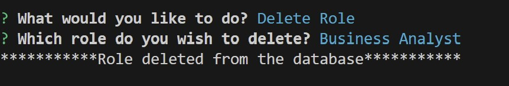

# employee-tracker

## Description

- Content Management Systems (CMS) are interfaces that allow non-developers to easily view and interact with information stored in databases.
- This project is a command line application from scratch to manage a company's database. 
- This allows user to preform CRUD operations on various entities of the company like Departments, Roles, Employees.
- During this implementation, I was able to apply my knowledge on Node.js, Inquirer, and PostgreSQL.

## Table of Contents 

- [Installation](#installation)
- [User Story](#user-story)
- [Usage](#usage)
- [Usage & Tests](#usageandtest-screenshots)
- [Acceptance Criteria](#acceptance-criteria)
- [DBSchema](#dbschema)
- [Credits](#credits)
- [License](#license)

## Installation

Follow these instructions to create your project and deploy it to GitHub Pages:

1. Create a new repository on your GitHub account and clone it to your computer.

2. When you're ready to deploy, use the git add, git commit, and git push commands to save and push your code to your GitHub repository.

3. Navigate to your GitHub repository in the browser and then select the Settings tab on the right side of the page.

4. On the Settings page, select Pages on the left side of the page. On the GitHub Pages screen, choose main in the dropdown under Branch. Click the Save button.

5. Navigate to <your-github-username.github.io/your-repository-name> and you will find that your new webpage has gone live! For example, if your GitHub username is "lernantino" and the project is "css-demo-site", then your URL would be <lernantino.github.io/css-demo-site>.

6. To ensure that the node_modules folder is not pushed in the GITHUB, the .gitignore has to be updated and included.

7. All the environment variables are added in the .env to ensure that the User credentials are confidential. A sample .env.EXAMPLE has been provided in the repository and the .env is added in the .gitignore.

## User-Story 
```
AS A business owner
I WANT to be able to view and manage the departments, roles, and employees in my company
SO THAT I can organize and plan my business
```

## Usage

Open the terminal and navigate to the project path **\logo-generator , run the command npm start and answer the questions prompts.
On completion all the questions, a logo.svg file will be generated from the inputs provided by the user.

**Link for the repository :** 

https://github.com/shwetakadam5/employee-tracker

**Link for the functionality demo :**
Quick Demo (Important):
https://drive.google.com/file/d/1Q1FeK5m3J6wqVfT7C4xShoVPOn7ln5iE/view


## UsageAndTest Screenshots :

#### 1. ****Employee Tracker : Start of application:****

 

#### 2. ****Employee Tracker : View Employees:****

 

#### 3. ****Employee Tracker : View Roles:****
 

#### 4. ****Employee Tracker : View Departments:****

 

#### 5. ****Employee Tracker : View Employees by Manager:****


#### 6. ****Employee Tracker : View Employees by Department:****

 

#### 7. ****Employee Tracker : View Total Utilizied Budget of the Department:****

 

#### 8. ****Employee Tracker : Add Employee:****

 

#### 9. ****Employee Tracker : Add Role:****

 

#### 10. ****Employee Tracker : Add Department:****

 

#### 11. ****Employee Tracker : Update Employee's Role:****

 

#### 12. ****Employee Tracker : Update Employee's Manager:****

 

#### 13. ****Employee Tracker : Delete Department****

 

#### 14. ****Employee Tracker : Delete Role:****

 

#### 15. ****Employee Tracker : Delete Employee:****

 

#### 16. ****Employee Tracker : Quit Application:****

 

#### 16. ****Employee Tracker : Example of error message logged using console.error and Error message displayed to user:****

 

## Acceptance-Criteria

```
GIVEN a command-line application that accepts user input
WHEN I start the application
THEN I am presented with the following options: view all departments, view all roles, view all employees, add a department, add a role, add an employee, and update an employee role
WHEN I choose to view all departments
THEN I am presented with a formatted table showing department names and department ids
WHEN I choose to view all roles
THEN I am presented with the job title, role id, the department that role belongs to, and the salary for that role
WHEN I choose to view all employees
THEN I am presented with a formatted table showing employee data, including employee ids, first names, last names, job titles, departments, salaries, and managers that the employees report to
WHEN I choose to add a department
THEN I am prompted to enter the name of the department and that department is added to the database
WHEN I choose to add a role
THEN I am prompted to enter the name, salary, and department for the role and that role is added to the database
WHEN I choose to add an employee
THEN I am prompted to enter the employee’s first name, last name, role, and manager, and that employee is added to the database
WHEN I choose to update an employee role
THEN I am prompted to select an employee to update and their new role and this information is updated in the database 
```

## DBSchema

```md
* `department`

  * `id`: `SERIAL PRIMARY KEY`

  * `name`: `VARCHAR(30) UNIQUE NOT NULL` to hold department name

* `role`

  * `id`: `SERIAL PRIMARY KEY`

  * `title`: `VARCHAR(30) UNIQUE NOT NULL` to hold role title

  * `salary`: `DECIMAL NOT NULL` to hold role salary

  * `department_id`: `INTEGER NOT NULL` to hold reference to department role belongs to

* `employee`

  * `id`: `SERIAL PRIMARY KEY`

  * `first_name`: `VARCHAR(30) NOT NULL` to hold employee first name

  * `last_name`: `VARCHAR(30) NOT NULL` to hold employee last name

  * `role_id`: `INTEGER NOT NULL` to hold reference to employee role

  * `manager_id`: `INTEGER` to hold reference to another employee that is the manager of the current employee (`null` if the employee has no manager)        
```

## Credits

* [pg package](https://www.npmjs.com/package/pg) to connect to your PostgreSQL database

* [Inquirer package](https://www.npmjs.com/package/inquirer/v/8.2.4) to interact with the user via the command line.

## Helpful Resources

* [native async/await keywords](https://node-postgres.com/guides/async-express).

* 

* [](https://2u-20.wistia.com/medias/2lnle7xnpk)


## License

MIT

